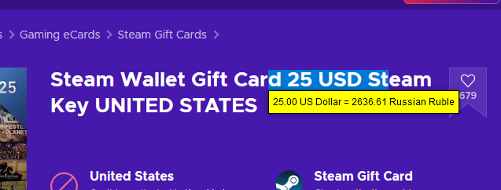
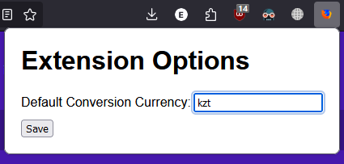
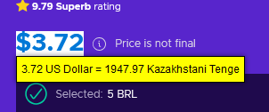

# Converter Extension 

you may want to set your currency before hand. work will be done later
currently works only with 3 letter codes (20 USD, 5000 KZT, etc)
thanks for API: https://github.com/fawazahmed0/exchange-api

